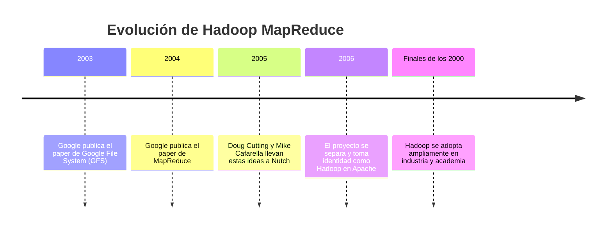

# 📜 Origen histórico de Hadoop MapReduce

## 🧩 ¿Por qué nació?

Hadoop MapReduce nació como respuesta a un problema crítico a inicios de los 2000:

> ¿Cómo procesar petabytes de datos distribuidos en miles de servidores de bajo costo?

El crecimiento explosivo de Internet hizo que los sistemas tradicionales (bases de datos relacionales y servidores únicos) ya no fueran suficientes.

---

## 🟦 El punto de partida: Google

En 2003–2004, Google publicó dos papers fundamentales:

- **Google File System (GFS)** → almacenamiento distribuido tolerante a fallos.
- **MapReduce: Simplified Data Processing on Large Clusters** → modelo de procesamiento distribuido basado en dos funciones:
  - **Map**: transforma datos en pares clave–valor.
  - **Reduce**: agrupa y agrega resultados.

Estas soluciones permitían procesar enormes volúmenes de datos en clusters de máquinas económicas.

---

## 🟦 Nacimiento de Hadoop

Doug Cutting implementó una versión open source de estas ideas dentro del proyecto Nutch.  
Posteriormente el proyecto se convirtió en:

**Apache Hadoop**

Hadoop integró:

- **HDFS** → inspirado en GFS.
- **MapReduce** → modelo de procesamiento distribuido.

---

## 🕒 Línea del tiempo

---

## 🎯 Problemas que resolvía

1. **Escalabilidad horizontal** (usar muchas máquinas económicas).
2. **Procesamiento masivo distribuido**.
3. **Tolerancia automática a fallos**.
4. **Capacidad de manejar Big Data real (logs, web, ciencia, finanzas).**

---

## 🧠 En síntesis

Hadoop MapReduce no nació por moda, sino por necesidad:

El crecimiento masivo de datos en Internet obligó a crear arquitecturas distribuidas capaces de almacenar y procesar información a gran escala de manera eficiente y tolerante a fallos.
