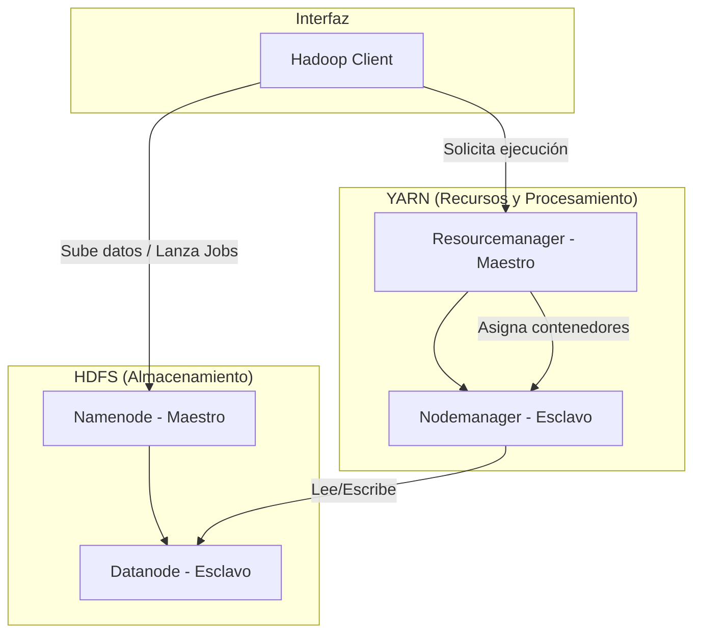

# Arquitectura de Hadoop en este Proyecto

Este proyecto implementa un cluster de Hadoop multi-contenedor mediante Docker para procesar datos de *clickstream* utilizando el modelo de programación **MapReduce** con **Python Streaming**.

## 1. Infraestructura de Hadoop (Docker)

La arquitectura sigue el modelo maestro-esclavo estándar tanto para almacenamiento como para procesamiento:

- **Namenode**: El "cerebro" del sistema de archivos (HDFS). Gestiona los metadatos y sabe dónde está cada bloque de datos.
- **Datanode**: Donde reside el dato real. En este proyecto hay un nodo que almacena los archivos subidos (ej: `clickstream.csv`).
- **Resourcemanager**: El gestor de recursos de YARN. Decide qué nodo tiene capacidad para ejecutar una tarea.
- **Nodemanager**: El agente en cada nodo que lanza y monitorea los contenedores de procesamiento.
- **Hadoop Client**: Contenedor desde el cual ejecutamos los comandos para mover archivos y lanzar los scripts de Python.

---

## 2. Pipeline de Procesamiento (MapReduce)

El procesamiento se divide en dos etapas encadenadas, ambas implementadas con **Hadoop Streaming**, lo que permite usar Python como lenguaje de Map/Reduce.

### Etapa 1: Sesionización (Sessionization)
El objetivo es agrupar eventos individuales en "sesiones" basadas en un tiempo de inactividad.

1.  **Mapper (`mapper_clickstream.py`)**:
    - Limpia y normaliza el CSV.
    - Emite una **clave compuesta**: `(user_id, timestamp)`.
2.  **Shuffle & Sort (Magia de Hadoop)**:
    - Utiliza un `Partitioner` para asegurar que todos los datos de un mismo `user_id` lleguen al mismo Reducer.
    - Aplica un **ordenamiento secundario** para que, dentro del Reducer, los eventos lleguen ordenados cronológicamente por el `timestamp`.
3.  **Reducer (`reducer_sessionize.py`)**:
    - Recibe el flujo ordenado de eventos por usuario.
    - Si el tiempo entre dos eventos supera el límite (ej. 30 min), cierra la sesión actual e inicia una nueva.
    - Calcula métricas por sesión (duración, paginas vistas, detección de anomalías como *botting* o *rapid clicking*).

### Etapa 2: Agregación por Usuario (Aggregation)
Toma los resultados de la etapa 1 y resume el comportamiento global de cada usuario.

1.  **Mapper (`mapper_user_agg.py`)**: Prepara los datos de sesión para ser agrupados por `user_id`.
2.  **Reducer (`reducer_user_agg.py`)**: Calcula promedios, totales y tasas de anomalía por cada usuario único.

---

## 3. Flujo de Datos Típico

1.  **Ingesta**: El script `run_hadoop_streaming.sh` toma el archivo local `data/clickstream_sample.csv` y lo sube al HDFS.
2.  **Ejecución**: Se lanzan los dos Jobs de MapReduce de forma secuencial. HDFS almacena los resultados intermedios.
3.  **Resultados**: El Reducer final guarda los datos en `/output/clickstream_user_metrics` dentro del HDFS, los cuales pueden ser consultados o descargados de vuelta al sistema local.
